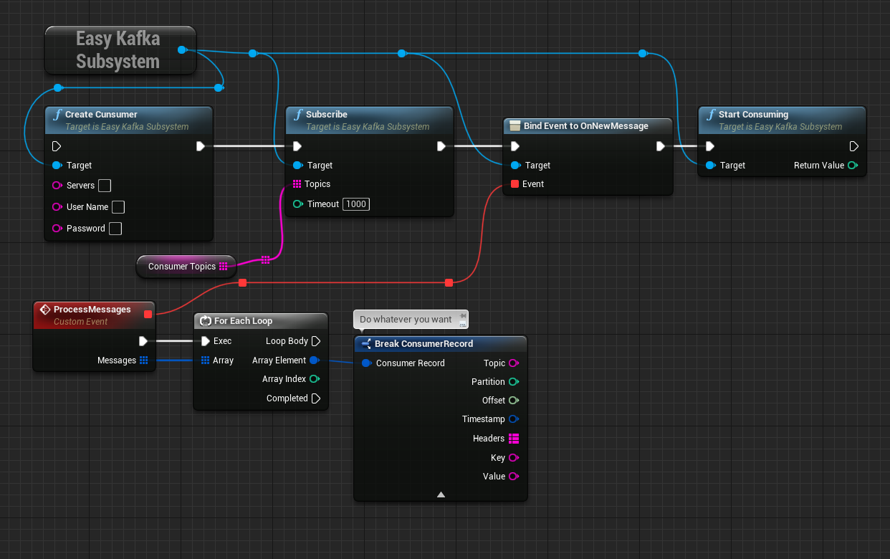
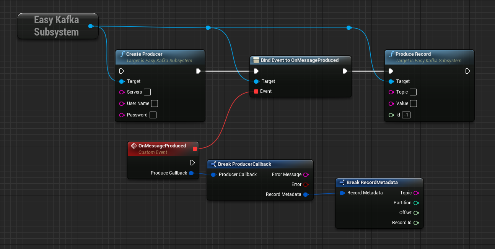
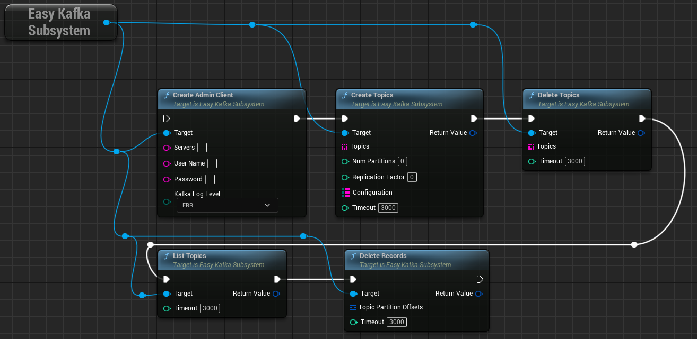

<h1 align="center">
  <br>
  <a href="https://discord.com/invite/MtGpAdM">
    
  </a>
  <br>
  Kafka Client for Unreal Engine 4/5
  <br>
</h1>

# EasyKafka subsystem

EasyKafka is a Kafka/Redpanda client sub-system for unreal engine. It supports producing and consuming records through blueprint and C++.

# Supported Platforms

 - Windows x86_64
 - Hololens 2 (Windows ARM64)
 - Linux x86_64
 - Linux ARM64

# C++ Modules Link

Link the plugin modules to your project through `<YourModule>.build.cs`:

```cs
CppStandard = CppStandardVersion.Cpp17;//avoid using boost
if(Target.Platform == UnrealTargetPlatform.HoloLens || Target.Platform == UnrealTargetPlatform.Win64)
	bUseRTTI = true;

 PrivateDependencyModuleNames.AddRange( new string[]
{
    "EasyKafka",
    "KafkaLib",
    "KafkaConsumer",
    "KafkaProducer",
    "KafkaAdmin"
});
```

# Kafka Consumer Basic Usage

**PAY ATTENTION TO THE BLOCKING METHODS.**
## C++

Create Consumer with default configuration:

```cpp
#include "EasyKafkaSubsystem.h"

TSharedPtr<FEasyKafkaModule> EasyKafka = GEngine->GetEngineSubsystem<UEasyKafkaSubsystem>()->GetEasyKafka();
EasyKafka->GetConsumer()->CreateConsumer(`<BOOTSTRAP_SERVERS_COMMA_SEPARATED>`, `<USERNAME>`, `<TOKEN/PASSWORD>`, (int)EKafkaLogLevel::ERR);
```

Create Consumer with configuration:

```cpp
#include "EasyKafkaSubsystem.h"

TSharedPtr<FEasyKafkaModule> EasyKafka = GEngine->GetEngineSubsystem<UEasyKafkaSubsystem>()->GetEasyKafka();

TMap<EKafkaConsumerConfig, FString> KafkaConfiguration =
{
	{EKafkaConsumerConfig::CLIENT_ID,"34235"},
	{EKafkaConsumerConfig::SOCKET_TIMEOUT_MS,"10000"}
};
EasyKafka->GetConsumer()->CreateConsumer(`<BOOTSTRAP_SERVERS_COMMA_SEPARATED>`, `<USERNAME>`, `<TOKEN/PASSWORD>`, KafkaConfiguration, (int)EKafkaLogLevel::ERR);
```

Consume messages:

```cpp
EasyKafka->GetConsumer()->OnNewMessage().AddLambda([](const TArray<FConsumerRecord>& Messages)
{
	for (FConsumerRecord Message : Messages)
	{
		UE_LOG(LogTemp, Display, TEXT("New Message %s \n"), *Message.Value);//process messages
	}
});

EasyKafka->GetConsumer()->Subscribe(
{
	"topic",
	"topic1",
	"topic2"
});

EasyKafka->GetConsumer()->StartConsuming();
```
**ATTENTION: MAKE SURE TO COMMIT FROM COSUMER RUNNABLE THREAD BEFORE PROCESSING RECORDS IF USE DISABLED AUTOCOMMIT.**

## Blueprint



# Kafka Producer Basic Usage

**PAY ATTENTION TO THE BLOCKING METHODS.**
## C++

Create Producer with default configuration:

```cpp
#include "EasyKafkaSubsystem.h"

TSharedPtr<FEasyKafkaModule> EasyKafka = GEngine->GetEngineSubsystem<UEasyKafkaSubsystem>()->GetEasyKafka();
EasyKafka->GetProducer()->CreateProducer(`<BOOTSTRAP_SERVERS_COMMA_SEPARATED>`, `<USERNAME>`, `<TOKEN/PASSWORD>`, (int)EKafkaLogLevel::ERR);
```

Create Producer with configuration:

```cpp
#include "EasyKafkaSubsystem.h"

TSharedPtr<FEasyKafkaModule> EasyKafka = GEngine->GetEngineSubsystem<UEasyKafkaSubsystem>()->GetEasyKafka();

TMap<EKafkaProducerConfig, FString> KafkaConfiguration =
{
	{EKafkaProducerConfig::MESSAGE_TIMEOUT_MS,"5000"},
	{EKafkaProducerConfig::REQUEST_TIMEOUT_MS,"5000"}
};
EasyKafka->GetProducer()->CreateProducer(`<BOOTSTRAP_SERVERS_COMMA_SEPARATED>`, `<USERNAME>`, `<TOKEN/PASSWORD>`, KafkaConfiguration, (int)EKafkaLogLevel::ERR);
```

on record produced/failed to produce callback

```cpp
EasyKafka->GetProducer()->OnProduce().AddLambda([](const FProducerCallback& Callback)
{

	if (Callback.bError)
	{
		UE_LOG(LogTemp, Error, TEXT("Error producing recordId: %d \nError Message: %s\n"), Callback.RecordMetadata.RecordId, *Callback.ErrorMessage);
	}
	else
	{
		UE_LOG(LogTemp, Display, TEXT("RecordId: %d produced.\n"), Callback.RecordMetadata.RecordId);
	}
});
```
produce record async

```cpp
EasyKafka->GetProducer()->ProduceRecord('<TOPIC>', '<"RECORD_VALUE>');

/*
More control over your record
Such as headers,Id...
*/

FProducerRecord record;
record.Key = "key";
record.Topic = "topic";
record.Value = "value";
record.Id = 2312;//Unique id to identify this record OnProduce callback;
record.Headers = FRecordHeader(
{ 
	{"KeyOne","ValueOne"},
	{"KeyTwo","ValueTwo"}
});

EasyKafka->GetProducer()->ProduceRecord(record);
```
## Blueprint



# Kafka Admin Basic Usage

**ALL THE METHODS ARE BLOCKING, ASYNC TO BE ADDED.**
## C++
Create Admin with default configuration:

```cpp
#include "EasyKafkaSubsystem.h"

TSharedPtr<FEasyKafkaModule> EasyKafka = GEngine->GetEngineSubsystem<UEasyKafkaSubsystem>()->GetEasyKafka();
EasyKafka->GetAdmin()->CreateAdmin(`<BOOTSTRAP_SERVERS_COMMA_SEPARATED>`, `<USERNAME>`, `<TOKEN/PASSWORD>`, (int)EKafkaLogLevel::ERR);
```
Create Admin with configuration:

```cpp
#include "EasyKafkaSubsystem.h"

TSharedPtr<FEasyKafkaModule> EasyKafka = GEngine->GetEngineSubsystem<UEasyKafkaSubsystem>()->GetEasyKafka();

TMap<EKafkaAdminConfig, FString> KafkaConfiguration =
{
	{EKafkaAdminConfig::SOCKET_TIMEOUT_MS,"10000"}
};
EasyKafka->GetAdmin()->CreateAdmin(`<BOOTSTRAP_SERVERS_COMMA_SEPARATED>`, `<USERNAME>`, `<TOKEN/PASSWORD>`, KafkaConfiguration, (int)EKafkaLogLevel::ERR);
```
## Blueprint



## Find it helpful?

Give us a ⭐️!

# License

Licensed under BSD 2-Clause [License](LICENSE.txt).

```
Copyright (c) 2022-2023 MrShaaban, Mohamad Shaaban.
```
